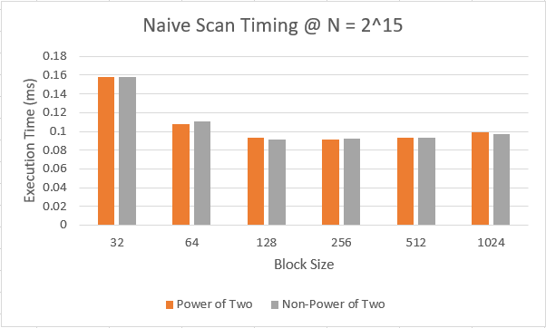
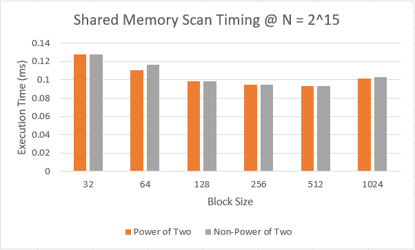
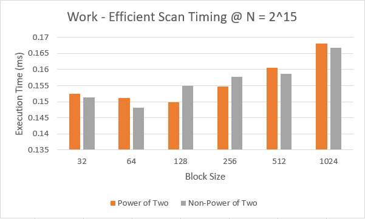
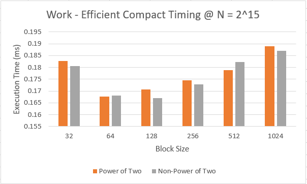
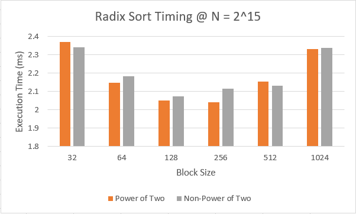
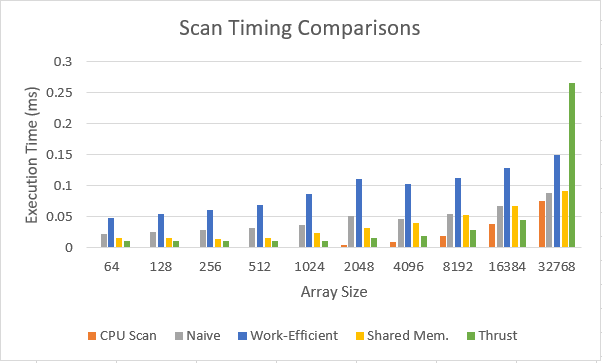
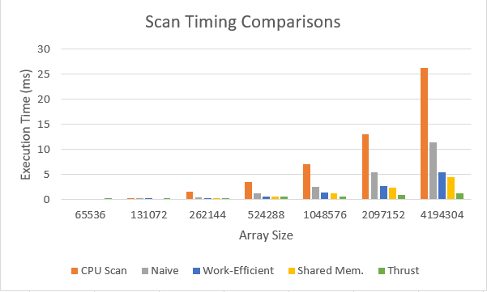
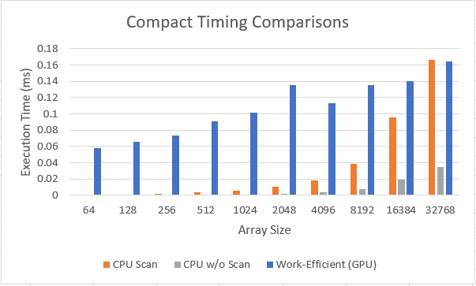
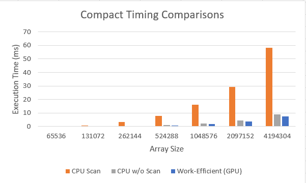

CUDA Stream Compaction
======================

**University of Pennsylvania, CIS 565: GPU Programming and Architecture, Project 2**

* Angelina Risi
  * [LinkedIn](www.linkedin.com/in/angelina-risi)
* Tested on: Windows 10, i7-6700HQ @ 2.60GHz 8GB, GTX 960M 4096MB (Personal Laptop)

## Project Description  
  
This project implements a variety of scan, compact and sort algorithms on the GPU with some comparison tests implemented on the CPU. The base requirements were to implement CPU Scan and Compact Functions, and to implement GPU Naive Scan and Compact and GPU Work-Efficient Scan and Compact. I also created a wrapper function for the Thrust scan implementation on the GPU.  
In addition to these base requirements, I implemented all the defined extra credit assignments. These were Radix sort, using shared GPU memory in the scan implementation, implementing memory bank conflict avoidance, and improving the work-efficient implementation's efficiency over the CPU implementation.  
  
### Features  
  
* CPU Scan  
* CPU Compact  
  - With and without scanning  
* GPU Naive Scan  
* GPU "Work-Efficient" Scan  
  - Including Shared Memory implementation (Extra Credit) w/ Bank Conflict resolution  
* GPU Stream Compaction  
  - Using Work-efficient scan, but can we replaced with other scan algorithms  
* GPU Radix Sort (Extra Credit)  
  
  
## Extra Credit

### Radix Sort Implementation

Radix sort is a method of sorting data in an array from min to max using the values' binary data. This is done by sorting by the least-significant bit (LSB) first, iterating through bit sorts until the most-significant bit (MSB).  
Before we can sort, we actually need to find the dataset's maximum value. By taking the ceiling of log<sub>2</sub>(max), we can get the max number of bits representing the data, which bit is the MSB. This reduces the number of redundant iterations of sorting from the number of bits in the data type to only as many relevant ones there are in the data range. This is done on the GPU using a parallel reduction algorithm comparing pairs of values. The code is reproduced below with extra commentary.  
  
```cpp
// each thread compares a pair of integers from the input buffer 
// and selects the greater of the two
__global__ void kernFindMax(int n, int offset1, int offset2, int* buff) {
    int index = (blockDim.x * blockIdx.x) + threadIdx.x;
   
    // compute which index to compare
    int access = index * offset2 - 1;
    if (access >= n || n < 1 || access < 0) return;

    // modify in place
    if (buff[access] < buff[access - offset1]) {
    buff[access] = buff[access - offset1];
    }
}
```
```cpp
// The loop iterates deeper into the reduction until the final max value is sorted to the end
// This essentially sweeps the max value up to the root of a balanced binary tree
for (d = 1; d <= limit; d++) {
    offset1 = pow(2, d - 1);
    offset2 = pow(2, d);
    fullBlocksPerGrid.x = ((size / offset2) + blockSize) / blockSize;
    kernFindMax << <fullBlocksPerGrid, blockSize >> >(size, offset1, offset2, max_arr);
    checkCUDAError("Radix find max fail!"); // error checking
}
```  
  
To perform the sort itself efficiently, we generate a a pair of boolean buffers indicating whether the currently tested bit at that index is 0 or 1. One buffer is the true buffer, called b_arr, and the other the false buffer, called f_arr. If the bit value is 1, b_arr[index] is set to 1 and f_arr to 0, and vice versa. We save the last value of f_arr for later to compute the number of "falses" for indexing.  
  
```cpp
__global__ void kernBoolMaps(int n, int k, int* input, int* b_arr, int* f_arr) {
    int index = (blockDim.x * blockIdx.x) + threadIdx.x;
    if (index >= n) return;
 
    // retrieve the kth bit from the input val
    int bit = bitK(input[index], k);
    // flip the bit
    int fBit = flipBit(bit);

    b_arr[index] = bit; // maps bit k into b_arr
    f_arr[index] = fBit; // copy flipped value here for scan
}
```  
  
The f_arr is scanned using the work-efficient exclusive scan to generate the "false" indices, the locations to store the data values if b_arr[index] == 0 in the output array. The "true" indices, t_arr, are generated as "index - f_arr[index] + totFalse". The total false values is the last value in the scanned f_arr plus the value we stored earlier from f_arr before scanning. By using a GPU-implemented scatter function, we save the input values sorted into the output buffer. To remove the need for more intermediate buffers for each sort step, the input and output arrays are ping-ponged (switch their pointers) each sort step.  
  
```cpp
__global__ void kernRadixScatter(int n, int *out, int *in, int *b_arr, int *f_arr, int *t_arr) {
    int index = (blockDim.x * blockIdx.x) + threadIdx.x;
    if (index >= n) return;
   
    // We compute the index to access by checking the boolean in b_arr
    // If true, we use the index in t_arr (true indexing array)
    // Else, we choose the index in f_arr (false indexing array)
    // The index "access" is where in the output array the input goes to.
    int access = b_arr[index] ? t_arr[index] : f_arr[index];
    out[access] = in[index];
}
```

Once the input array has been sorted for each bit, the output is correctly sorted in order of ascending value. This implementation is intended to work on integer values, and currently operates on global device memory, bottlenecking performance. An example of a small array radix sort is depicted:  

  
  
### Shared Memory Work-Efficient Scan
  
An alternative implementation of the work-efficient scan using shared memory to reduce latency is included. Each block stores an array shared among its threads to store the intermediate values before outputting. By reducing global memory accesses and instead using faster shared memory, we can potentially increase thoroughput. Additionally, rather than increasing the scan buffer size to a power of two we need only increase it to a multiple of the buffer size.  
Both the upsweep and downsweep are done in the same kernel as they need to both used the shared memory cache. This means we cannot dynamically change the block and threadcount as we traverse the tree as done in the global memory solution, and we must be careful to synchronize threads between write and read operations to prevent race conditions. Each block essentially performs a scan on a portion of the input data. The depth level (required level of looping) of this scan is log<sub>2</sub>(blockSize). While there is some overhead described below that makes the depth comparable to log<sub>2</sub>(n), the reduced memory latency in this portion of the scan should provide improvement over the global memory equivalent.  
To allow the merging of the blocks' solutions, while we calculate an exclusive scan through the downsweep, we save the root value of the tree in the index blockSize of the shared memory array.  
The blocks must add the root value of all previous blocks to their total to calculate the correct prefix sum values of the array. This requires a second scan over all the blocks sums. To simplify the problem of having to recursively scan and stitch together blocks of data for large input data sets, instead of doing a shared memory scan for the second scan, the Work-Efficient scan using global memory was used. This second data set should be much smaller than the first, keeping the extra compute overhead minimal, as log<sub>2</sub>(n / blockSize) = log<sub>2</sub>(n) - log<sub>2</sub>(blockSize) depth level in this scan.  
Once the root sums were scanned, the outputs of both scans we put through a kernel call to stitch together the block data correctly by adding the correct sum value to each of the original output's values. This requires only a simple parallel addition.  
  
```cpp
__global__ void kernStitch(int n, int* in, int* sums) {
    int bx = blockIdx.x;
    int index = (blockDim.x * bx) + threadIdx.x;;

    if (bx == 0) return;
    if (index >= n) return;
    in[index] += sums[bx];
}
```  
#### Bank Conflict Avoidance  
  
This shared memory scan algorithm is further improved by using offsets on the shared memory access iterators to reduce bank conflicts, events where multiple threads attempt to access a region of shared memory at the same time and must wait for the bus to become free. This is done by applying macros to calculate an offset on the shared memory index based on the assumed number of memory banks. These are taken from the example code in GPU Gems 3 Ch. 39 linked in the instructions. The offset macro is reproduced below, as is example code of its use from my scan function.  

```cpp
// for reducing bank conflicts
#define NUM_BANKS 32 // Number of memory banks assumed on SM
#define LOG_NUM_BANKS 5 // log2(NUM_BANKS)
#define CONFLICT_FREE_OFFSET(n) \
    ((n) >> NUM_BANKS + (n) >> (2 * LOG_NUM_BANKS)) 
    // Offset added to each shared memory index so that more threads accesses through diff bank
    // so fewer must wait in line to use the same memory bus (thus less latency)
```
```cpp
// Upsweep
for (offset = 1; offset < blockSize; offset *=2) { // this offset is for calculating the original indices
    access = (2 * offset * (tx + 1)) - 1; // index of shared memory to access
    a2 = access - offset; // secondary access index
    
    a2 += CONFLICT_FREE_OFFSET(a2); // add safe offset to access index
    access += CONFLICT_FREE_OFFSET(access); // add safe offset to access index
    
    if (access < blockSize) sBuf[access] += sBuf[a2]; // manipulate data at offset indices
    __syncthreads(); // avoid mem issues
}
```  
  
## Test Output  

'''
****************
** SCAN TESTS **
****************
    [  15  38  45  12  38  26   6  23  30   2  34  33   7 ...   1   0 ]
==== cpu scan, power-of-two ====
   elapsed time: 0.077432ms    (std::chrono Measured)
    [   0  15  53  98 110 148 174 180 203 233 235 269 302 ... 809545 809546 ]
==== cpu scan, non-power-of-two ====
   elapsed time: 0.058864ms    (std::chrono Measured)
    [   0  15  53  98 110 148 174 180 203 233 235 269 302 ... 809458 809482 ]
    passed
==== naive scan, power-of-two ====
   elapsed time: 0.099264ms    (CUDA Measured)
    [   0  15  53  98 110 148 174 180 203 233 235 269 302 ... 809545 809546 ]
    passed
==== naive scan, non-power-of-two ====
   elapsed time: 0.098816ms    (CUDA Measured)
    passed
==== work-efficient scan, power-of-two ====
   elapsed time: 0.164352ms    (CUDA Measured)
    [   0  15  53  98 110 148 174 180 203 233 235 269 302 ... 809545 809546 ]
    passed
==== work-efficient scan, non-power-of-two ====
   elapsed time: 0.156096ms    (CUDA Measured)
    [   0  15  53  98 110 148 174 180 203 233 235 269 302 ... 809458 809482 ]
    passed
==== thrust scan, power-of-two ====
   elapsed time: 0.57184ms    (CUDA Measured)
    passed
==== thrust scan, non-power-of-two ====
   elapsed time: 0.29728ms    (CUDA Measured)
    passed
==== Find max, power-of-two ====
   elapsed time: 0.059936ms    (CUDA Measured)
max = 49
==== Find max, non-power-of-two ====
   elapsed time: 0.05984ms    (CUDA Measured)
max = 49
==== Radix sort, power-of-two ====
   elapsed time: 2.60947ms    (CUDA Measured)
    [   0   0   0   0   0   0   0   0   0   0   0   0   0 ...  49  49 ]
==== Radix sort, non-power-of-two ====
   elapsed time: 2.29824ms    (CUDA Measured)
    [   0   0   0   0   0   0   0   0   0   0   0   0   0 ...  49  49 ]
==== Radix example sort ====
Test input array:
    [   4   7   2   6   3   5   1   0 ]
   elapsed time: 0.464576ms    (CUDA Measured)
Sorted Output:
    [   0   1   2   3   4   5   6   7 ]
==== Shared Memory Efficient Scan, power-of-two ====
   elapsed time: 0.0904ms    (CUDA Measured)
    [   0  15  53  98 110 148 174 180 203 233 235 269 302 ... 809545 809546 ]
    passed
==== Shared Memory Efficient Scan, non-power-of-two ====
   elapsed time: 0.11568ms    (CUDA Measured)
    [   0  15  53  98 110 148 174 180 203 233 235 269 302 ... 809458 809482 ]
    passed

*****************************
** STREAM COMPACTION TESTS **
*****************************
    [   1   0   3   3   2   3   1   0   3   0   0   3   2 ...   2   0 ]
==== cpu compact without scan, power-of-two ====
   elapsed time: 0.116543ms    (std::chrono Measured)
    [   1   3   3   2   3   1   3   3   2   1   3   3   2 ...   1   2 ]
    passed
==== cpu compact without scan, non-power-of-two ====
   elapsed time: 0.132346ms    (std::chrono Measured)
    [   1   3   3   2   3   1   3   3   2   1   3   3   2 ...   2   2 ]
    passed
==== cpu compact with scan ====
   elapsed time: 0.390321ms    (std::chrono Measured)
    [   1   3   3   2   3   1   3   3   2   1   3   3   2 ...   1   2 ]
    passed
==== work-efficient compact, power-of-two ====
   elapsed time: 0.171744ms    (CUDA Measured)
    passed
==== work-efficient compact, non-power-of-two ====
   elapsed time: 0.192384ms    (CUDA Measured)
    passed
==== Shared Memory work-efficient compact, power-of-two ====
   elapsed time: 0.234592ms    (CUDA Measured)
    passed
==== Shared Memory work-efficient compact, non-power-of-two ====
   elapsed time: 0.236352ms    (CUDA Measured)
    passed
'''
  
  
## Performance Analysis  

To get a rough estimate on the advantages of performance of each method, a loop was added to the main function to generate an array, run  each scan and compact algorithm, and measure the time it took to run. This loop repeats 100 times and the average timing data is output after. By running this analysis for different block sizes and data set sizes, we can approximate performance in each case. The radix sort performance is also tested, but is not meant to be compared with the others due to performing a very different function.

### Varying Block Size  
  
The performance was first tested on a set of data with 2<sup>15</sup> (32,768) integer values (minus 3 for the non-power-of-two test). The block size was varied at powers of 2 from 32 (the reasonable minimum, the warp size) to 1024 (the max threads per block of this GPU). This performance test was to decide on an optimal blocksize for testing these algorithms against the CPU scan and compact algorithms. We do not test Thrust in this manner as we only wrap its implementation.

   
  
   
  
The average time to execute varies slightly between runs, but we can approximate the optimal blocksize from which size gives te shortest execution times on average. For some, the difference is minimal, making it difficult to choose, but the final selection is as follows:  
  
* Naive Scan: 256
* Work-Efficient Scan: 64
* Shared Memory Scan: 512

The larger block size for the shared memory scan is likely more efficient due to both sharing memory across more threads and fewer total blocks to stitch together, reducing the latency from the secondary scan on block sums. In contrast, the work-efficient scan is most efficient for smaller block sizes. This may be due to the simplicity of the kernels and the decreasing number of active blocks per iteration allowing better thoroughput with smaller threadcounts per block.
  
  
  
The Radix sort appears most efficient at 128 or 256 threads per block. Since the average between power-of-two and non-power-of-two array speeds is better for an array of size 128, this value is chosen.  
  

### Varying Data Set Sizes  

Once the algorithms' block sizes were optimized, they could be tested for varying data set sizes. The data size was swept through powers of two from 2<sup>6</sup> (64) to 2<sup>22</sup> (4,194,304) for completeness in examining small to large data sets.  
  
   
  
The scan algorithms were first compared. The plots demonstrate that the CPU implementation is actually significantly faster at first, but is overtaken by all the GPU implementations around an array size of 2<sup>18</sup>. This is due to the CPU scan scaling directly with array size, while GPU implementations mitigate this with parallelism. Interesting to note is a sudden jump in thrust scan time at 2<sup>15</sup>, but much slower time scaling otherwise. This is assumed to be due to how thrust optimizes scan processing or allocates the arrays. The work efficient scan is actually slower than the naive scan as well, but the shared memory work-efficient scan is faster than naive, and it eventually is faster than naive scan at larger array sizes.
  
   

Compation was implemented on the CPU with and without scanning and on the GPU with the work efficient scan. The CPU compact without scanning requires less computation and is thus very fast. The GPU manages to become faster than the CPU at an array size of 2<sup>19</sup>, when the array size is large enough that iterating over each index is slower than the parallel GPU map, scan, and scatter algorithm.  
  
These analyses show that unless properly optimized, the CPU can be faster than the GPU on small enough data sets with simple enough computations.

